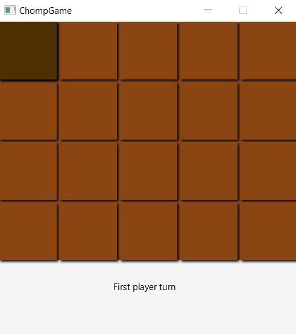
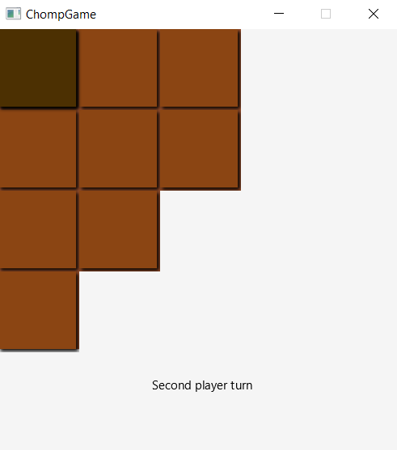
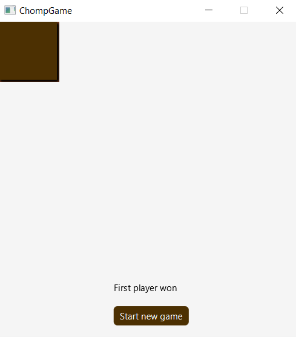

# Chomp Game

[](https://www.rebar3.org/)
[](https://mvnrepository.com/artifact/org.erlang.otp/jinterface)
[](https://mvnrepository.com/artifact/org.openjfx/javafx-graphics)

Project showcasing usage of jinterface - library made for connecting erlang application with java. Rules of the game can be found [here](https://en.wikipedia.org/wiki/Chomp).

## [Chomp Api](./chompApi/src)
Erlang gen_server application.

### Run server
```
cd chompApi 
rebar3 shell --sname apiNode --setcookie erljava
```

## [ChompClient](./chompClient/src/main/java)
Java application responsible for communication with erlang server and visualization of game.

## Showcase






